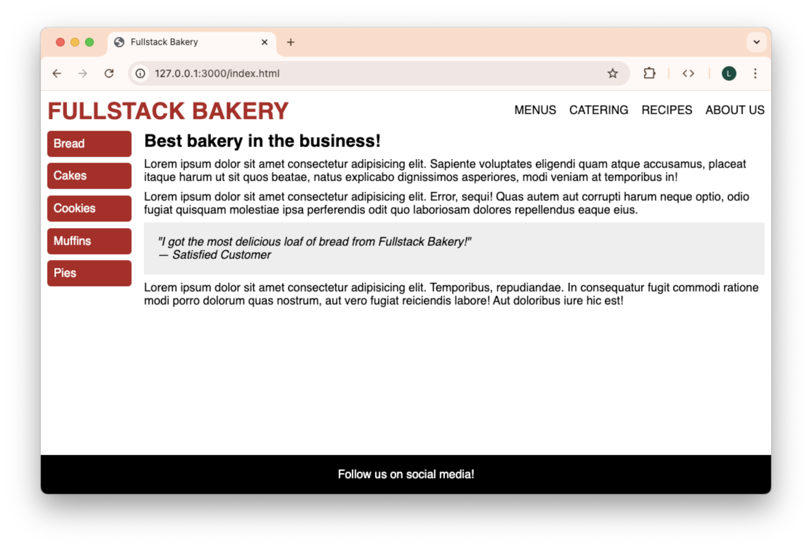

# Fullstack Bakery

In this workshop, you'll be using flexbox to style the front page of a fictional
bakery named Fullstack Bakery.

## Getting Started

1. Create a new repository under your GitHub account using this one as a template.
2. Clone your repository down to your local machine.
3. Open the cloned folder with VS Code.
4. Live serve `index.html` to see the page that you will have to style.

## Instructions

Your task is to style the given `index.html` so that the page has a visually
distinct horizontal navbar at the top, a vertical sidebar on the left, an article
of text to the right, and a footer at the bottom. You are free to style the page
however you'd like, as long as your submission meets the following requirements.
You may use the provided screenshot above as a reference for one possible solution,
but be creative and make it your own!

1. CSS rules are written in external CSS files and linked to `index.html`.
2. Text properties, such as family, color, or size, have been changed.
3. A combination of `margin` and `padding` have been used for visual spacing between elements.
4. `gap` is used instead of `margin` and `padding` when spacing flex children.
5. Relative units are used so that visual spacing scales accordingly with the font size.
6. The sidebar list items have a different background color from the rest of the page.
7. The testimonial has a different background color from the rest of the page.
8. The footer has a different background color from the rest of the page.
9. The contrast ratios of all text on the page pass WCAG AA standards.
10. Flexbox is used to style the header as a horizontal navbar.
11. Flexbox is used to style the aside as a vertical sidebar.

> [!TIP]
>
> Remember that flexbox only applies to an element's _direct_ children!
> When working on the sidebar, you'll want to `display:flex` the `<ul>`,
> not the `<aside>`.

12. The `main` element grows to fill up the vertical free space in `body`,
    and the footer is flush with the bottom of the viewport.

> [!TIP]
>
> Think about adding a `flex-grow` property to `<main>`!

## Submission

Please submit the link to your public GitHub repository.
